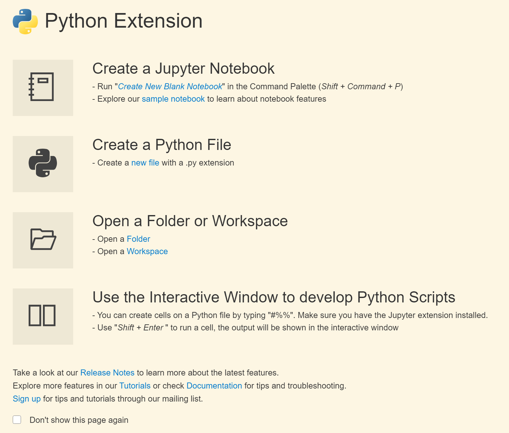

# Extensions

VS Code lets other programmers extend its functionality by developing extensions, which are directly plugged into its user interface. You can browse and install extensions from within VS Code. VS Code shows the most popular extensions on [VS Code Marketplace](https://marketplace.visualstudio.com/) when you click on the Extensions icon in the Activity Bar. Each Extension includes a brief description that shows its functionalities and shows the download count and rating. By Selecting them, the item will be displayed on the left side of the VS Code windows.

To install any extensions, select the install button. Once the installation is complete, the button is changed to the Manage gear button. If you have difficulty finding the right extensions, you can check the download count. The one with the highest download count is a good candidate to check out.

You can filter the Extensions view with the Filter Extensions context menu and view a list of currently installed extensions, extensions that need updating, recommended extensions based on your workspace, and a list of globally popular extensions. You can also sort the list by Install Count or Rating. To find a list of all available extensions, check out the [Extension Marketplace](https://code.visualstudio.com/docs/editor/extension-marketplace)

Some of the most popular extensions on the marketplace are:

## [TODO Highlight](https://marketplace.visualstudio.com/items?itemName=wayou.vscode-todo-highlight)

TODO highlight shows the TODOs in your comments with a different colour. You can also make a list of all highlighted annotations.

## [Prettier](https://marketplace.visualstudio.com/items?itemName=esbenp.prettier-vscode)

This extension is a code formatter that helps you enforce consistent style in your project. It is particularly useful if you have multiple people working on the project. 

## [GitLens](https://marketplace.visualstudio.com/items?itemName=eamodio.gitlens)

GitLens adds more functionality to the built-in Git capabilities of VS Code and allows you to see who, why, and how lines of code have changed over time.

## [Code Runner](https://marketplace.visualstudio.com/items?itemName=formulahendry.code-runner)

Code Runner is an extension that enables you to run snippets of code or code files written in a variety of languages right in Visual Studio Code. 

## [Grammarly (unofficial)](https://marketplace.visualstudio.com/items?itemName=znck.grammarly)

If you use Markdown or LaTeX in VS Code to write your articles, linking Grammarly can help you to easily check spelling and grammar. While the extension is not officially supported and has some issues, it is the best option available right now.

## [IntelliSense](https://code.visualstudio.com/docs/editor/intellisense)

IntelliSense is a general term for various code editing features including code completion, parameter info, quick info, and member lists. Microsoft and VS Code community are developing and maintaining IntellSense extensions for almost all languages and you can find them by searching in the marketplace.

## Markdown Extensions

If you are using Markdown to write documentation or reports, VS Code extension can help you to write them more efficiently and visualize them quickly. The [Markdown All in One](https://marketplace.visualstudio.com/items?itemName=yzhang.markdown-all-in-one) adds keyboard shortcuts to quickly make words italic or bold. You can also run **Create Table of Contents** in the Command Palette to add a table of content to your file, which will be updated when you save the file. The [Markdown Preview Enhanced](https://marketplace.visualstudio.com/items?itemName=shd101wyy.markdown-preview-enhanced) is another extension that improves the built-in Markdown preview in VS Code. You can open the preview using `Ctrl + Shift + V` shortcut.

### Example: Setting Up VSCode for Python Programming

You can open a freshly installed Visual Studio Code to make a new file and write code in Python (or any programming language) and run them using your preferred terminal. However, without any extensions, you have no access to auto-complete, snippets, intelli-sense, and you cannot properly debug your code.

The [Python extension](https://marketplace.visualstudio.com/items?itemName=ms-python.python) in VS Code adds several useful capabilities that we are going to investigate here. To use this extension on your VS Code, you need to install a [supported version of Python](https://code.visualstudio.com/docs/python/python-tutorial#_prerequisites) on your system and then install the [Python extension](https://marketplace.visualstudio.com/items?itemName=ms-python.python) using the **Extensions Bar**.

After installing the Python extension, you can choose the right version of Python in the **Status Bar**. If you have not installed Python on your system, VS Code will ask for the address of the interpreter. Install a supported [Python Interpreter](https://code.visualstudio.com/docs/python/python-tutorial#_install-a-python-interpreter) and locate that. 

Now, make a new Python file using **File>New File** and setting the programming language to Python. The Python Extension opens a new window after installation. In this Windows, you can choose to **
Create a Jupyter Notebook** or **Create a Python File**. To run cells in a Jupyter Notebook, you also need to install Jupyter extension on your system. 

#### Extension Setting

After installing an extension, you can change the extension settings by clicking on the gear button on the extension page.

#### IntelliSense

Autocomplete and IntelliSense are provided for all files within the current working folder. IntelliSense provides suggestions and shows the definition and arguments of the functions declared by you or used from imported libraries.

#### Linting

Linting is the process of checking the code for syntactical and stylistic errors. The extension you installed also uses a linter, **PyLint**, that highlights problems in your source code. For example, it detects uninitialized or undefined variables, calls to undefined functions, missing parentheses, using unimported libraries and much more. You can select a linter by opening the Command Palette, `Ctrl + Shift + P`, and selecting **Python: Select Linter**. If you enable a linter that is not installed in your selected environment, VS Code prompts you to install the required packages.

Linting runs automatically when you save a file and you can run it manually by opening the Command Palette and selecting **Python: Run Linting**. Issues are shown in the **Problems** panel. Also, hovering over an underlined issue displays the details.

#### Formatting

Formatting helps people to read the code easier by applying rules and conventions for line spacing, indents, spacing around operators and much more. The changes applied to the code by formatting do not change the functionality of the code. Formatters are also known as beautifiers or indenters.

There are online code formatters such as [codebeautify.org](https://codebeautify.org) that support different languages such as Java, C++, and Python. The Python Extension you installed supports different formatters, such as **autopepp8**, **black**, and **yapf**. The Python Extension looks in the current `pythonPath` for the formatter. The formatter should be installed in that location or you should specify the current location of the formatter.

#### Refactoring

The Python extension supports three types of refactoring. You can invoke them by either using the Context Menu (right-click on a selection) and selecting the right refactoring or by selecting **Python Refactor** in the Command Palette.

- Extract Variable: extracts all similar occurrences of the selected text and replaces it with a variable

- Extract Method: extracts all similar occurrences of the selected expression or block and replaces it with a method call

- Sort Imports: it uses the `isort` package and consolidates specific imports of the same module into a single `import` statement and organize them in alphabetical order

