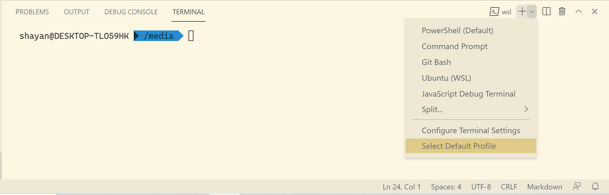

# Terminal

The terminal or command-line interface (CLI) is an interface in which you can type and execute text-based commands. Terminals also might be called console, shell, command line, or command prompt. Different operating systems provide shells for executing commands and remote applications.

VS Code provides a fully-featured integrated terminal. It is integrated with the editor and simplifies file navigation and compilation of your projects. To open the terminal, use **View > Terminal** menu command or press `Ctrl+\`` shortcut.

The terminal is shown at the bottom of the screen and the terminal tabs view is on the right side of the terminal view. Each terminal has its own name. You can open WSL, Windows Powershell, or any other available terminal on your OS by choosing it from the list. 

The integrated terminal features link detection. Files or URLs are shown with an underline in the terminal and will be opened with a mouse click when the `Ctrl` is held.
{: .note}

## Command-line interpreter or shells 

Unix Shell or Microsoft Windows **Command Prompt** and **Powershell** can be accessed by Terminal. While **Powershell** supports some Linux commands, if you like the feel and simplicity of a Linux shell, you can install [Windows Subsystem for Linux](https://docs.microsoft.com/en-us/windows/wsl/install-win10) on your Windows machine. You can install different Linux distributions and use **bash** commands. **Bash** is one of the most popular Unix shells. 

If you like to use a command interpreter with more features, try [**Zsh**](https://www.zsh.org/). **Zsh** is highly customizable and **Oh My Zsh** is a community-driven framework that provides lots of plugins and themes to enhance your command line experience. For example, you can view the state of your Git repository right inside the terminal. You can install **Oh My Zsh** [here](https://ohmyz.sh/#install).

*Zsh with agnoster theme*

